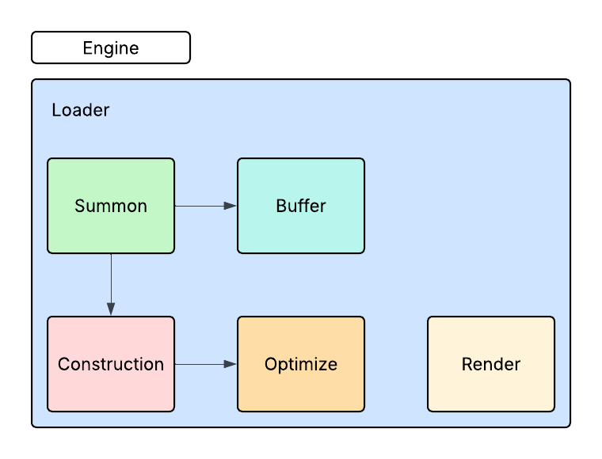
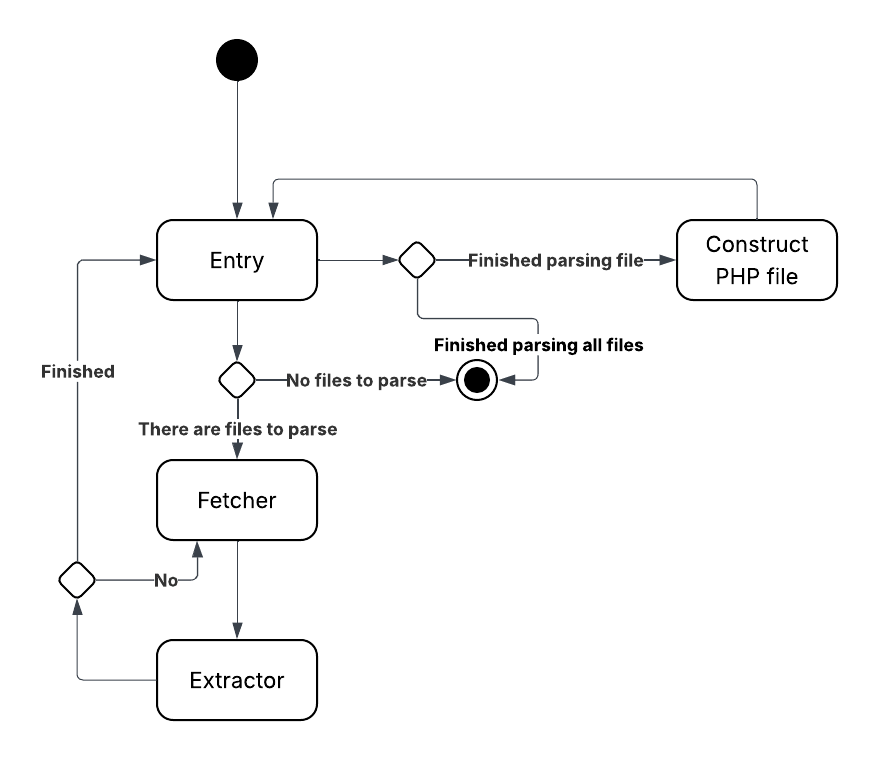
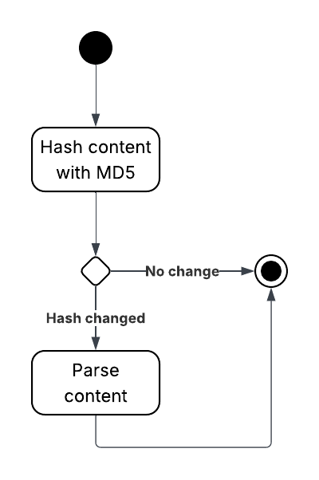

# Ease PHP Template Engine

  

> [!NOTE]
> ease TE is currently in its alpha version.

## Description

Ease is a lightweight, flexible template engine built with PHP, designed to streamline and enhance the development of dynamic PHP applications. It offers a modular architecture centered around fundamental components called "eases," where each ease represents a distinct element or factor within the page structure. This approach promotes clean separation of concerns, enabling developers to manage layout, logic, and content more efficiently.

Templates created with Ease use the .ease.php file extension, clearly distinguishing them from standard PHP files and ensuring better organization within your project structure.

## System Architecture

The core of the Ease Template Engine is its main component: the Engine. The Engine itself is composed of several subcomponents, with the most critical being the Summon entity.

  

**Summon**
The Summon entity serves as the central entry point and orchestrator of the engine's functionality. It is comprised of three primary classes:

1. **Entry**
   Acts as the main entry point of the engine. It is responsible for locating and opening the view folder to access .ease.php template files.

2. **Fetcher**
   Handles the process of reading and fetching the lines of code from the Ease template files. It prepares the content for transformation into the appropriate PHP script.

3. **Extractor**
   Extracts the necessary logic and script from the parsed Ease templates. This component interprets the logic within the templates and ensures it integrates correctly with the resulting PHP output.

**Construction**
After completing its operations, the Entry class triggers the ConstructPHP process, which belongs to the Construction component of the engine. This step initiates the construction of the final PHP file based on the extracted logic and structure.

  

**Buffer**
The Buffer component is responsible for storing the parsed content of the Ease file. It acts as temporary memory during processing, allowing the engine to manipulate and structure the content before rendering.

**Render**
The Render component provides the core rendering functionality of the engine. It is tasked with displaying the final parsed and processed content stored in the Buffer, outputting it as a valid PHP response.

**Optimize**
Optimize is the component responsible for detecting changes in content using the MD5 hash technique. It helps prevent unnecessary parsing by skipping processing if the content has not changed.

  

